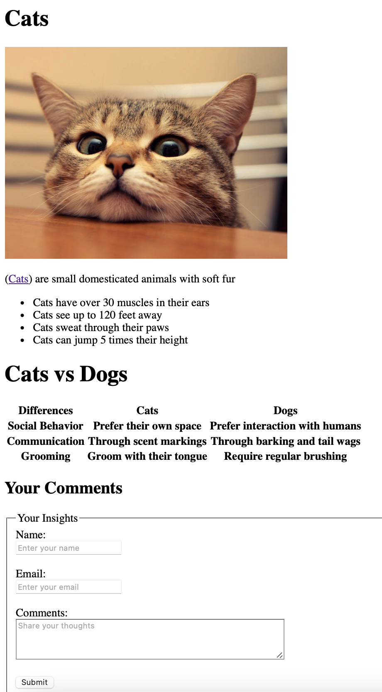

# Beginner Html Example

This html page makes use of certain useful tags such as 
- headers
- title
- paragraphs
- ordered list
- list
- form

The file uses exteranal references for the image in a webpage.  
I used ```python -m http.server 8000``` to view the html page in a browser.     
<br>
<br>
## This is a visual representation of what it looks like:


